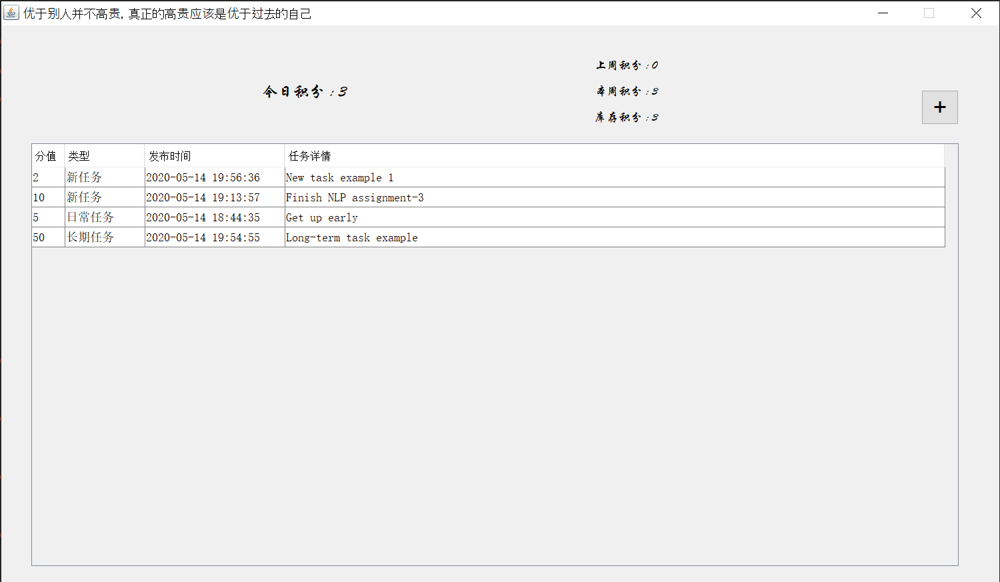
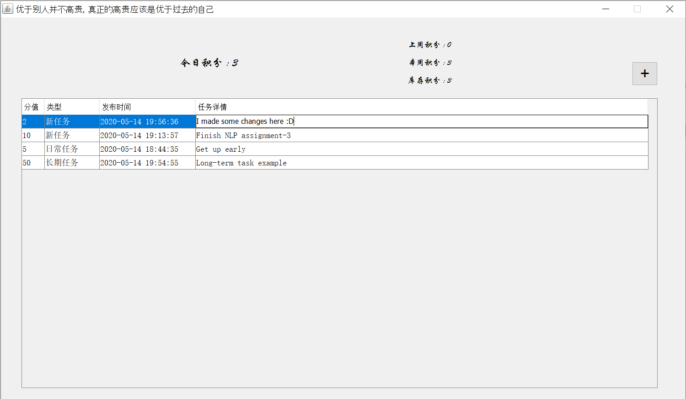
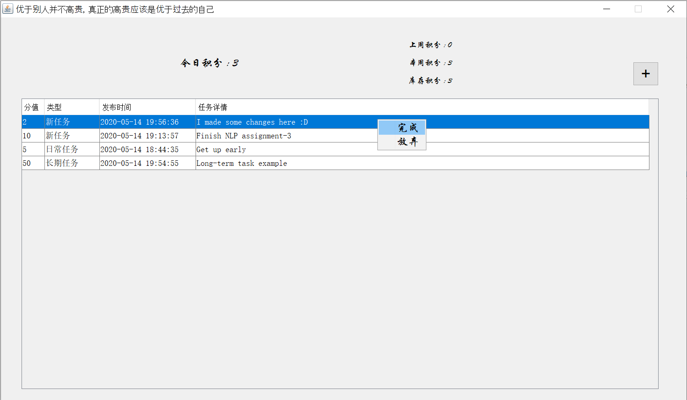
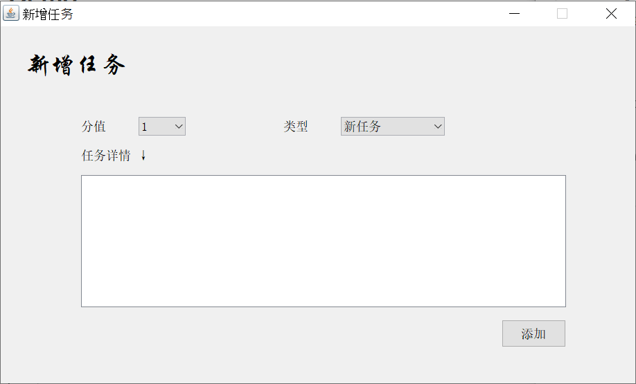
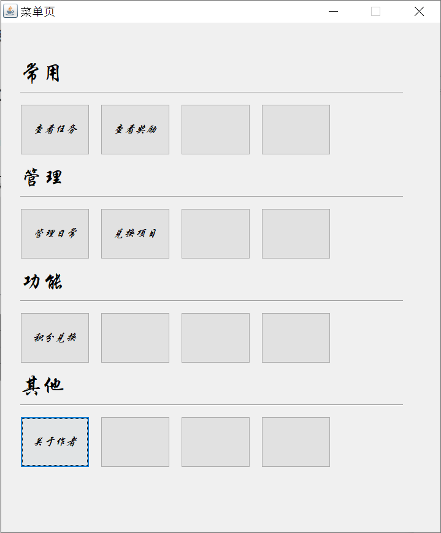
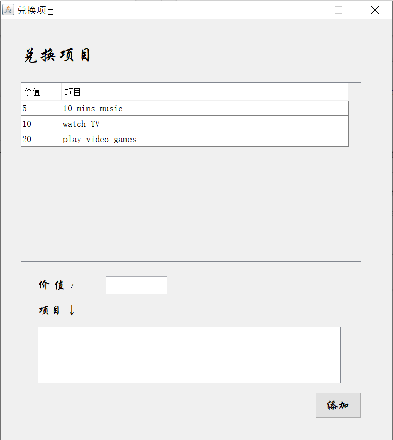
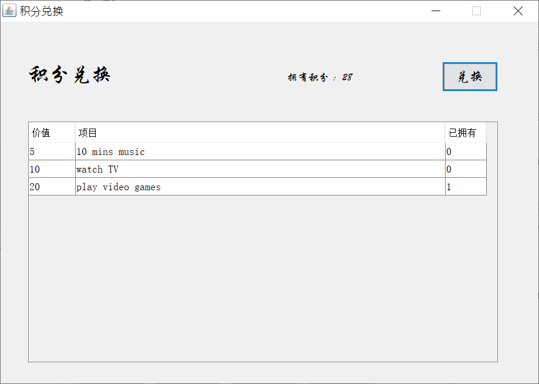
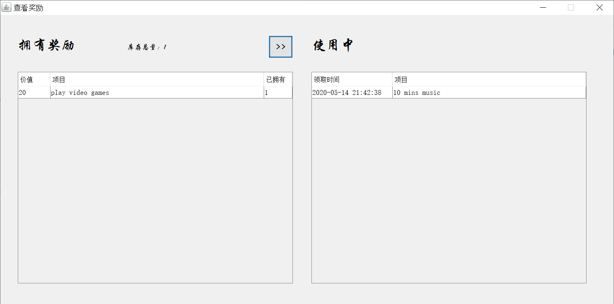

## Introduction

A todo list program. Each time you finish a task ahead of deadline, you will get some points. And the opposite, you will lose points if you missed the deadline. You can redeem the points to get some rewards like watching TV, playing video games or anything you want.

## Timeline

- Start Date: 2016/10/05
- Last Update: 2016/11/08

## GitHub Link

https://github.com/zecwang/self-challenge-todo-list

<!--more-->

## Demo

### Main interface

You can edit existed tasks directly:

To end the task (it's done or I give up):

### Add new task

### Menu interface

### Customize your rewards

### Redeem your reward points

